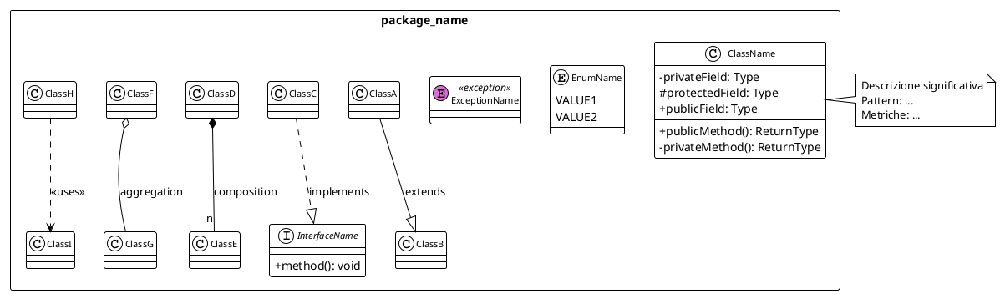

# Piano Dettagliato di Documentazione - QT Clustering Project

> **Documento di Planning**: Piano completo per la creazione di documentazione tecnica e utente
> **Data creazione**: 2025-11-09
> **Stato**: In Approvazione

---

## Indice

1. [Sommario Esecutivo](#sommario-esecutivo)
2. [Analisi Struttura Progetto](#analisi-struttura-progetto)
3. [Piano README per Moduli](#piano-readme-per-moduli)
4. [Piano Diagrammi UML](#piano-diagrammi-uml)
5. [Piano Manuale Utente](#piano-manuale-utente)
6. [Suddivisione in Iterazioni](#suddivisione-in-iterazioni)
7. [Stime Temporali](#stime-temporali)
8. [Criteri di Accettazione](#criteri-di-accettazione)

---

## Sommario Esecutivo

### Obiettivo

Produrre documentazione completa, professionale ed esaustiva per il progetto **Quality Threshold Clustering Algorithm**, seguendo standard accademici.

### Deliverables Previsti

| Categoria | Deliverable | Quantità | Formato |
|-----------|-------------|----------|---------|
| **README Moduli** | README.md per ciascun modulo principale | 4 file | Markdown |
| **Diagrammi UML** | Class diagrams per package | 11 file | PlantUML (.puml) |
| **Diagrammi UML** | Sequence diagrams per flussi critici | 4 file | PlantUML (.puml) |
| **Manuale Utente** | Manuale completo per GUI e TUI | 1 file | Markdown |
| **TOTALE** | | **20 file** | |

### Approccio

- **Fase 1**: Recupero contesto e planning (COMPLETATO)
- **Fase 2**: Generazione README moduli (3 iterazioni)
- **Fase 3**: Generazione diagrammi UML (2 iterazioni)
- **Fase 4**: Generazione manuale utente (1 iterazione)

---

## Analisi Struttura Progetto

### Panoramica Moduli

Il progetto è strutturato in **4 moduli principali**:

```
MAP/
├── qtServer/        # Server multi-client per clustering
├── qtClient/        # Client CLI per connessione al server
├── qtGUI/           # Interfaccia grafica JavaFX
└── qtExt/           # Testing e utility di benchmarking
```

### Struttura Package Dettagliata

#### 1. qtServer (Modulo Server)

**Path**: `/home/user/MAP/qtServer/`

**Package e Classi**:

```
qtServer/
├── src/
│   ├── data/                    # Package: Gestione dati e attributi
│   │   ├── Attribute.java              (abstract)
│   │   ├── DiscreteAttribute.java
│   │   ├── ContinuousAttribute.java
│   │   ├── Item.java                   (abstract)
│   │   ├── DiscreteItem.java
│   │   ├── ContinuousItem.java
│   │   ├── Tuple.java
│   │   ├── Data.java
│   │   ├── EmptyDatasetException.java
│   │   └── InvalidDataFormatException.java
│   │
│   ├── database/                # Package: Integrazione JDBC
│   │   ├── DbAccess.java
│   │   ├── TableSchema.java
│   │   ├── TableData.java
│   │   ├── Example.java
│   │   ├── QUERY_TYPE.java            (enum)
│   │   ├── DatabaseConnectionException.java
│   │   ├── EmptySetException.java
│   │   └── NoValueException.java
│   │
│   ├── mining/                  # Package: Algoritmo clustering
│   │   ├── QTMiner.java
│   │   ├── Cluster.java
│   │   ├── ClusterSet.java
│   │   ├── DistanceCache.java
│   │   ├── SerializableClusteringData.java
│   │   ├── ClusteringRadiusException.java
│   │   ├── IncompatibleClusterException.java
│   │   └── InvalidFileFormatException.java
│   │
│   └── server/                  # Package: Comunicazione client-server
│       ├── MultiServer.java
│       └── ServerOneClient.java
```

**Totale classi**: 28 classi

#### 2. qtClient (Modulo Client)

**Path**: `/home/user/MAP/qtClient/`

**Package e Classi**:

```
qtClient/
└── src/
    ├── MainTest.java                  # Entry point client
    ├── ServerException.java           # Eccezione comunicazione
    └── keyboardinput/                 # Package: Input robusto
        └── Keyboard.java              # Classe per input validato
```

**Totale classi**: 3 classi

#### 3. qtGUI (Modulo Interfaccia Grafica)

**Path**: `/home/user/MAP/qtGUI/`

**Package e Classi**:

```
qtGUI/
└── src/main/java/
    ├── gui/
    │   ├── MainApp.java                   # Entry point JavaFX
    │   ├── Launcher.java                  # Launcher wrapper
    │   │
    │   ├── charts/                        # Package: Visualizzazioni
    │   │   ├── ChartViewer.java
    │   │   └── ClusterScatterChart.java
    │   │
    │   ├── controllers/                   # Package: MVC Controllers
    │   │   ├── MainController.java
    │   │   ├── HomeController.java
    │   │   ├── ClusteringController.java
    │   │   ├── ResultsController.java
    │   │   └── SettingsController.java
    │   │
    │   ├── dialogs/                       # Package: Dialoghi modali
    │   │   ├── AboutDialog.java
    │   │   ├── DatasetPreviewDialog.java
    │   │   └── StatisticsDialog.java
    │   │
    │   ├── models/                        # Package: Modelli dati
    │   │   ├── ClusteringResult.java
    │   │   └── ClusteringConfiguration.java
    │   │
    │   ├── services/                      # Package: Business logic
    │   │   ├── ClusteringService.java
    │   │   ├── DataImportService.java
    │   │   └── ExportService.java
    │   │
    │   └── utils/                         # Package: Utilità
    │       ├── ApplicationContext.java
    │       ├── ColorPalette.java
    │       └── ThemeManager.java
    │
    └── module-info.java                   # Module descriptor
```

**Totale classi**: 20 classi

#### 4. qtExt (Modulo Testing e Utility)

**Path**: `/home/user/MAP/qtExt/`

**Package e Classi**:

```
qtExt/
├── tests/                         # Package: Test suite
│   ├── TestQTAlgorithm.java
│   ├── TestClusterOperations.java
│   ├── TestDataOperations.java
│   ├── TestDistanceCalculations.java
│   ├── TestContinuousAttributes.java
│   └── TestIteratorsComparators.java
│
└── utility/                       # Package: Utility e benchmark
    ├── QTBenchmark.java
    ├── RunBenchmark.java
    └── DatasetGenerator.java
```

**Totale classi**: 9 classi

### Metriche Complessive

| Modulo | Package | Classi | LOC Stimate |
|--------|---------|--------|-------------|
| qtServer | 4 | 28 | ~3,500 |
| qtClient | 2 | 3 | ~400 |
| qtGUI | 7 | 20 | ~2,800 |
| qtExt | 2 | 9 | ~1,200 |
| **TOTALE** | **15** | **60** | **~7,900** |

---

## Piano README per Moduli

### Struttura Standard README.md

Ogni README seguirà questa struttura:

```markdown
# [Nome Modulo] - Quality Threshold Clustering

## Descrizione Generale
- Scopo del modulo
- Funzionalità principali
- Posizione nell'architettura generale

## Architettura Interna
- Struttura package
- Diagramma organizzazione (riferimento a UML)
- Pattern di design utilizzati

## Package

### [Nome Package 1]
- **Scopo**: ...
- **Classi principali**: ...
- **Interfacce pubbliche**: ...
- **Diagramma UML**: `docs/uml/[modulo]/[package]/`

### [Nome Package 2]
...

## Dipendenze

### Dipendenze Interne
- Altri moduli del progetto

### Dipendenze Esterne
- Librerie terze parti (se presenti)

## Interfacce Pubbliche (API)
- Metodi entry point
- Protocolli di comunicazione (se applicabile)

## Interazioni con Altri Moduli
- Flussi di dati
- Chiamate tra moduli

## Build e Compilazione
- Comandi make/javac
- Output attesi

## Testing
- Approccio di testing
- Test disponibili

## Note di Manutenzione
- Considerazioni per modifiche future
- Best practices
```

### README Specifici

#### README #1: qtServer/README.md

**Ubicazione**: `/home/user/MAP/qtServer/README.md`

**Sezioni specifiche**:

- Architettura client-server multi-threaded
- Protocollo di comunicazione Socket
- Integrazione database JDBC
- Algoritmo QT con caching distanze
- Serializzazione cluster
- Deployment come server standalone

**Riferimenti UML**:
- `docs/uml/qtServer/data/`
- `docs/uml/qtServer/database/`
- `docs/uml/qtServer/mining/`
- `docs/uml/qtServer/server/`

**Pagine stimate**: 8-10 pagine Markdown

---

#### README #2: qtClient/README.md

**Ubicazione**: `/home/user/MAP/qtClient/README.md`

**Sezioni specifiche**:

- Client CLI interattivo
- Package keyboardinput per input robusto
- Protocollo comunicazione con qtServer
- Gestione errori di rete
- Comandi disponibili
- Esempi di utilizzo

**Riferimenti UML**:
- `docs/uml/qtClient/keyboardinput/`
- `docs/uml/qtClient/client_server_sequence.puml` (Sequence diagram)

**Pagine stimate**: 4-5 pagine Markdown

---

#### README #3: qtGUI/README.md

**Ubicazione**: `/home/user/MAP/qtGUI/README.md`

**Sezioni specifiche**:

- Architettura MVC JavaFX
- Pattern Observer per reattività
- Dark/Light theme management
- Visualizzazione cluster con scatter chart
- Export multipli formati (CSV, TXT, ZIP)
- Integrazione con qtServer
- Gestione stato applicazione (ApplicationContext)

**Riferimenti UML**:
- `docs/uml/qtGUI/controllers/`
- `docs/uml/qtGUI/services/`
- `docs/uml/qtGUI/models/`
- `docs/uml/qtGUI/charts/`
- `docs/uml/qtGUI/dialogs/`
- `docs/uml/qtGUI/utils/`

**Pagine stimate**: 10-12 pagine Markdown

---

#### README #4: qtExt/README.md

**Ubicazione**: `/home/user/MAP/qtExt/README.md`

**Sezioni specifiche**:

- Test suite completa
- Benchmark performance
- Dataset generator per testing
- Metriche di qualità clustering
- Come eseguire i test
- Interpretazione risultati benchmark

**Riferimenti UML**:
- `docs/uml/qtExt/tests/`
- `docs/uml/qtExt/utility/`

**Pagine stimate**: 5-6 pagine Markdown

---

### Totale README: 4 file, ~30 pagine Markdown stimate

---

## Piano Diagrammi UML

### Specifiche Tecniche

- **Tool**: PlantUML
- **Formato file**: `.puml`
- **Stile**: Seguire template esistente in `docs/uml/qtServer/data/data_package.puml`
- **Convenzioni**:
  - Usare `!theme plain`
  - Includere note esplicative
  - Mostrare cardinalità relazioni
  - Evidenziare pattern di design
  - Includere commenti PlantUML

### Diagrammi da Generare

#### Diagrammi di Classe (Class Diagrams)

**Totale**: 11 diagrammi

| # | File | Package | Ubicazione | Classi Incluse |
|---|------|---------|------------|----------------|
| 1 | `data_package.puml` | qtServer/data | `docs/uml/qtServer/data/` | **ESISTE GIA'** |
| 2 | `database_package.puml` | qtServer/database | `docs/uml/qtServer/database/` | DbAccess, TableSchema, TableData, Example, eccezioni |
| 3 | `mining_package.puml` | qtServer/mining | `docs/uml/qtServer/mining/` | QTMiner, Cluster, ClusterSet, DistanceCache, eccezioni |
| 4 | `server_package.puml` | qtServer/server | `docs/uml/qtServer/server/` | MultiServer, ServerOneClient |
| 5 | `keyboardinput_package.puml` | qtClient/keyboardinput | `docs/uml/qtClient/keyboardinput/` | Keyboard |
| 6 | `controllers_package.puml` | qtGUI/controllers | `docs/uml/qtGUI/controllers/` | MainController, HomeController, ClusteringController, ResultsController, SettingsController |
| 7 | `services_package.puml` | qtGUI/services | `docs/uml/qtGUI/services/` | ClusteringService, DataImportService, ExportService |
| 8 | `models_package.puml` | qtGUI/models | `docs/uml/qtGUI/models/` | ClusteringResult, ClusteringConfiguration |
| 9 | `charts_dialogs_utils.puml` | qtGUI/charts+dialogs+utils | `docs/uml/qtGUI/views/` | ChartViewer, ClusterScatterChart, AboutDialog, DatasetPreviewDialog, StatisticsDialog, ApplicationContext, ColorPalette, ThemeManager |
| 10 | `tests_package.puml` | qtExt/tests | `docs/uml/qtExt/tests/` | Test* (6 classi test) |
| 11 | `utility_package.puml` | qtExt/utility | `docs/uml/qtExt/utility/` | QTBenchmark, RunBenchmark, DatasetGenerator |

#### Diagrammi di Sequenza (Sequence Diagrams)

**Totale**: 4 diagrammi

| # | File | Flusso Descritto | Ubicazione |
|---|------|------------------|------------|
| 1 | `clustering_workflow_sequence.puml` | Flusso completo clustering (GUI → Service → Server → Mining) | `docs/uml/workflows/` |
| 2 | `client_server_communication_sequence.puml` | Protocollo comunicazione qtClient ↔ qtServer | `docs/uml/workflows/` |
| 3 | `data_import_sequence.puml` | Caricamento dataset (CSV, DB, File) | `docs/uml/workflows/` |
| 4 | `export_workflow_sequence.puml` | Export risultati (CSV, TXT, ZIP) | `docs/uml/workflows/` |

### Template PlantUML Standard

Ogni diagramma seguirà questo template:



### Totale Diagrammi UML: 15 file (.puml)

---

## Piano Manuale Utente

### Struttura Manuale Utente

**File**: `/home/user/MAP/docs/manuale_utente/MANUALE_UTENTE.md`

**Formato**: Markdown con placeholder per immagini

### Indice Proposto

```markdown
# Manuale Utente - Quality Threshold Clustering

## 1. Introduzione
### 1.1 Cos'è il Quality Threshold Clustering?
### 1.2 Panoramica del Sistema
### 1.3 Quick Start

## 2. Installazione e Configurazione
### 2.1 Requisiti di Sistema
### 2.2 Installazione Java
### 2.3 Compilazione del Progetto
### 2.4 Configurazione Database (Opzionale)
### 2.5 Avvio del Server

## 3. Interfaccia Grafica (GUI)
### 3.1 Panoramica Interfaccia
   <!-- [IMMAGINE]: Screenshot schermata principale -->
### 3.2 Schermata Home
   - Selezione dataset
   - Caricamento da file CSV
   - Caricamento da database
   - Anteprima dataset
   <!-- [IMMAGINE]: Home screen con dataset selector -->
### 3.3 Schermata Clustering
   - Configurazione parametri (radius)
   - Avvio clustering
   - Barra di progresso
   <!-- [IMMAGINE]: Clustering configuration -->
### 3.4 Schermata Risultati
   - Visualizzazione cluster
   - Scatter chart
   - Tabella dettagliata
   - Esportazione risultati
   <!-- [IMMAGINE]: Results view con scatter chart -->
### 3.5 Schermata Impostazioni
   - Tema (Light/Dark)
   - Configurazione database
   - Preferenze applicazione
   <!-- [IMMAGINE]: Settings panel -->
### 3.6 Menu e Scorciatoie
   - Menu File
   - Menu Edit
   - Menu View
   - Menu Help
   - Tabella keyboard shortcuts

## 4. Interfaccia Testuale (TUI) - Client CLI
### 4.1 Avvio del Client
### 4.2 Connessione al Server
### 4.3 Comandi Disponibili
   - LOAD_DATA
   - SET_RADIUS
   - RUN_CLUSTERING
   - GET_RESULTS
   - SAVE_RESULTS
   - DISCONNECT
### 4.4 Esempi di Sessioni
   <!-- [ESEMPIO]: Sessione completa CLI -->
### 4.5 Gestione Errori

## 5. Workflow Comuni
### 5.1 Clustering da File CSV (GUI)
   - Passo 1: Importazione
   - Passo 2: Configurazione
   - Passo 3: Esecuzione
   - Passo 4: Analisi risultati
   - Passo 5: Export
### 5.2 Clustering da Database (GUI)
### 5.3 Clustering Remoto (CLI)
### 5.4 Salvataggio e Ricaricamento Risultati

## 6. Export e Reportistica
### 6.1 Export CSV
### 6.2 Export Report Testuale
### 6.3 Export Pacchetto ZIP
### 6.4 Salvataggio Cluster (.dmp)

## 7. Troubleshooting
### 7.1 Problemi Comuni
   - Errore connessione database
   - Errore formato CSV
   - Server non raggiungibile
   - Out of memory
### 7.2 Soluzioni
### 7.3 Log e Debugging

## 8. FAQ
### 8.1 Come scegliere il radius ottimale?
### 8.2 Qual è la dimensione massima dataset supportata?
### 8.3 Come interpretare i cluster?
### 8.4 Differenze tra attributi discreti e continui?
### 8.5 Come migliorare le performance?

## 9. Appendici
### Appendice A: Formato File .dmp
### Appendice B: Formato CSV Supportato
### Appendice C: Schema Database
### Appendice D: Parametri Configurazione
### Appendice E: Codici Errore

## 10. Glossario
- Cluster
- Centroide
- Radius
- Distanza di Hamming
- Distanza Euclidea
- Tuple
- Attributo discreto
- Attributo continuo
```

### Placeholder per Immagini

Totale placeholder previsti: **15-20 immagini**

**Lista Placeholder**:

```markdown
<!-- [IMMAGINE]: Screenshot schermata principale GUI - dimensione: 1200x800 -->
<!-- [IMMAGINE]: Home screen con dataset selector - dimensione: 800x600 -->
<!-- [IMMAGINE]: Clustering configuration panel - dimensione: 800x600 -->
<!-- [IMMAGINE]: Results view con scatter chart - dimensione: 1200x800 -->
<!-- [IMMAGINE]: Scatter chart con 5 cluster colorati - dimensione: 800x600 -->
<!-- [IMMAGINE]: Tabella dettaglio cluster - dimensione: 1000x600 -->
<!-- [IMMAGINE]: Settings panel dark mode - dimensione: 800x600 -->
<!-- [IMMAGINE]: Settings panel light mode - dimensione: 800x600 -->
<!-- [IMMAGINE]: Statistics dashboard - dimensione: 1000x700 -->
<!-- [IMMAGINE]: About dialog - dimensione: 600x400 -->
<!-- [IMMAGINE]: Dataset preview dialog - dimensione: 800x600 -->
<!-- [IMMAGINE]: Export dialog con opzioni - dimensione: 600x400 -->
<!-- [IMMAGINE]: Esempio output CLI client - dimensione: 800x400 -->
<!-- [IMMAGINE]: Esempio sessione completa TUI - dimensione: 800x600 -->
<!-- [IMMAGINE]: Esempio file CSV input - dimensione: 600x300 -->
```

### Caratteristiche Manuale

- **Stile**: Chiaro, accessibile, orientato ai compiti
- **Tono**: Informale ma professionale
- **Pubblico**: Utenti finali con conoscenze tecniche di base
- **Lunghezza stimata**: 40-50 pagine Markdown
- **Formato output**: Markdown (convertibile in PDF/HTML)

### Totale Manuale Utente: 1 file, ~50 pagine Markdown

---

## Suddivisione in Iterazioni

### Iterazione 1: README qtServer e qtClient + UML Base

**Durata stimata**: 4-5 ore

**Deliverables**:

- [x] Piano di documentazione (questo documento)
- [ ] `qtServer/README.md` (8-10 pagine)
- [ ] `qtClient/README.md` (4-5 pagine)
- [ ] `docs/uml/qtServer/database/database_package.puml`
- [ ] `docs/uml/qtServer/mining/mining_package.puml`
- [ ] `docs/uml/qtServer/server/server_package.puml`
- [ ] `docs/uml/qtClient/keyboardinput/keyboardinput_package.puml`

**Obiettivi**:

- Documentare l'architettura server e client
- Generare UML per package critici del server
- Stabilire template e convenzioni

**Dipendenze**: Nessuna (può iniziare subito)

**Criteri di completamento**:

- [ ] README compilano correttamente (nessun link rotto)
- [ ] UML compilano con PlantUML
- [ ] Riferimenti incrociati corretti
- [ ] Coerenza terminologica

---

### Iterazione 2: README qtGUI e qtExt + UML GUI

**Durata stimata**: 4-5 ore

**Deliverables**:

- [ ] `qtGUI/README.md` (10-12 pagine)
- [ ] `qtExt/README.md` (5-6 pagine)
- [ ] `docs/uml/qtGUI/controllers/controllers_package.puml`
- [ ] `docs/uml/qtGUI/services/services_package.puml`
- [ ] `docs/uml/qtGUI/models/models_package.puml`
- [ ] `docs/uml/qtGUI/views/charts_dialogs_utils.puml`
- [ ] `docs/uml/qtExt/tests/tests_package.puml`
- [ ] `docs/uml/qtExt/utility/utility_package.puml`

**Obiettivi**:

- Documentare architettura GUI (MVC, JavaFX)
- Documentare testing e benchmarking
- Completare UML per tutti i package

**Dipendenze**: Iterazione 1 (per coerenza stile)

**Criteri di completamento**:

- [ ] README compilano correttamente
- [ ] UML compilano con PlantUML
- [ ] Architettura MVC ben documentata
- [ ] Pattern di design evidenziati

---

### Iterazione 3: Diagrammi di Sequenza + Manuale Utente

**Durata stimata**: 5-6 ore

**Deliverables**:

- [ ] `docs/uml/workflows/clustering_workflow_sequence.puml`
- [ ] `docs/uml/workflows/client_server_communication_sequence.puml`
- [ ] `docs/uml/workflows/data_import_sequence.puml`
- [ ] `docs/uml/workflows/export_workflow_sequence.puml`
- [ ] `docs/manuale_utente/MANUALE_UTENTE.md` (40-50 pagine)

**Obiettivi**:

- Documentare flussi di interazione critici
- Creare manuale utente completo con placeholder immagini
- Completare tutta la documentazione

**Dipendenze**: Iterazioni 1 e 2 (per riferimenti)

**Criteri di completamento**:

- [ ] Sequence diagram corretti e completi
- [ ] Manuale utente copre tutti i workflow
- [ ] Placeholder immagini ben posizionati
- [ ] Struttura navigabile e chiara

---

### Riepilogo Iterazioni

| Iterazione | Deliverables | Durata | Dipendenze |
|------------|--------------|--------|------------|
| **Iterazione 1** | 2 README + 4 UML | 4-5 ore | Nessuna |
| **Iterazione 2** | 2 README + 6 UML | 4-5 ore | Iterazione 1 |
| **Iterazione 3** | 4 UML + Manuale | 5-6 ore | Iterazioni 1-2 |
| **TOTALE** | 4 README + 14 UML + 1 Manuale | **13-16 ore** | |

---

## Stime Temporali

### Breakdown Dettagliato

| Attività | Tempo Unitario | Quantità | Tempo Totale |
|----------|----------------|----------|--------------|
| README modulo (medio) | 1.5 ore | 4 | 6 ore |
| Diagramma UML classe | 30 minuti | 10 | 5 ore |
| Diagramma UML sequenza | 45 minuti | 4 | 3 ore |
| Manuale utente | 3 ore | 1 | 3 ore |
| Review e correzioni | - | - | 2 ore |
| **TOTALE STIMATO** | | | **19 ore** |

### Contingency

- **Buffer per imprevisti**: +20% → **3.8 ore**
- **Totale con buffer**: **22-23 ore**

### Distribuzione Temporale Consigliata

- **Giorno 1-2**: Iterazione 1 (README server/client + UML base)
- **Giorno 3-4**: Iterazione 2 (README GUI/Ext + UML GUI)
- **Giorno 5-6**: Iterazione 3 (Sequence diagrams + Manuale)
- **Giorno 7**: Review finale e correzioni

**Totale stimato**: **5-7 giorni lavorativi** (part-time, 3-4 ore/giorno)

---

## Criteri di Accettazione

### Criteri Generali

- [x] Piano di documentazione approvato dall'utente
- [ ] Tutti i deliverables elencati sono stati creati
- [ ] Nessun link rotto o riferimento mancante
- [ ] Coerenza terminologica tra tutti i documenti
- [ ] Stile uniforme (tono, formattazione, struttura)
- [ ] Compilazione PlantUML senza errori per tutti gli UML

### Criteri README Moduli

- [ ] Ogni README include tutte le sezioni obbligatorie
- [ ] Architettura interna ben spiegata
- [ ] Dipendenze chiaramente documentate
- [ ] Interfacce pubbliche (API) descritte
- [ ] Istruzioni di build verificate e funzionanti
- [ ] Riferimenti UML corretti

### Criteri Diagrammi UML

- [ ] Seguono template standard PlantUML
- [ ] Usano nomenclatura coerente con codice
- [ ] Includono note esplicative significative
- [ ] Mostrano relazioni e cardinalità
- [ ] Evidenziano pattern di design
- [ ] File naming convention: `[package]_package.puml`

### Criteri Manuale Utente

- [ ] Copre sia GUI che TUI
- [ ] Workflow comuni ben documentati
- [ ] Placeholder immagini posizionati correttamente
- [ ] Sezione troubleshooting completa
- [ ] FAQ rispondono a domande comuni
- [ ] Appendici con dettagli tecnici
- [ ] Glossario con termini chiave
- [ ] Indice navigabile

### Criteri di Qualità

#### Completezza
- [ ] Nessun modulo/package senza documentazione
- [ ] Tutti i flussi critici hanno sequence diagram
- [ ] Tutte le funzionalità utente documentate

#### Coerenza
- [ ] Stile linguistico uniforme
- [ ] Struttura README consistente
- [ ] Convenzioni UML seguite ovunque

#### Precisione
- [ ] Informazioni rispecchiano fedelmente il codice
- [ ] Nessuna informazione obsoleta
- [ ] Esempi di codice/comandi testati

#### Leggibilità
- [ ] Testo ben organizzato
- [ ] Facile navigazione
- [ ] Uso appropriato di liste, tabelle, diagrammi

#### Manutenibilità
- [ ] Documentazione aggiornabile facilmente
- [ ] Modularità (modifiche locali non rompono globali)
- [ ] Riferimenti centralizati quando possibile

---

## Note Finali

### Risorse Disponibili

- **Documentazione esistente**:
  - `docs/sprints/` (Sprint 0-8 già documentati)
  - `docs/gui_sprints/` (Sprint GUI già documentati)
  - `docs/uml/qtServer/data/data_package.puml` (Template di riferimento)
  - `CLAUDE.md` (Contesto completo progetto)
  - `docs/SPRINT_ROADMAP.md` (Roadmap completa)

### Assunzioni

- Codice sorgente è stabile e non subirà modifiche maggiori durante documentazione
- PlantUML è disponibile per generazione diagrammi
- Utente fornirà feedback su piano prima di procedere all'implementazione

### Rischi e Mitigazioni

| Rischio | Probabilità | Impatto | Mitigazione |
|---------|-------------|---------|-------------|
| Codice cambia durante documentazione | Media | Alto | Congelare codebase o documentare in iterazioni brevi |
| UML troppo complessi da leggere | Bassa | Medio | Suddividere package grandi, usare note esplicative |
| Manuale utente troppo tecnico | Media | Medio | Review con focus su chiarezza, esempi pratici |
| Stime temporali insufficienti | Media | Basso | Buffer 20% già incluso, iterazioni indipendenti |

---

## Prossimi Passi

### Approvazione Piano

1. **Utente rivede questo piano**
2. **Fornisce feedback/modifiche**
3. **Approva per procedere**

### Esecuzione

1. **Iterazione 1**: README qtServer/qtClient + UML base
2. **Iterazione 2**: README qtGUI/qtExt + UML GUI
3. **Iterazione 3**: Sequence diagrams + Manuale utente
4. **Review finale**: Verifica criteri accettazione

### Formato Consegna

Ogni iterazione verrà consegnata con:

- Pull Request dedicata su branch `claude/qtc-documentation-planning-011CUxxW1UA53rvzNGW3ypeM`
- Commit messaggi descrittivi
- File organizzati nella struttura corretta
- README.md principale aggiornato con riferimenti

---

**Fine Piano di Documentazione**

*Attendiamo approvazione per procedere con l'esecuzione.*
